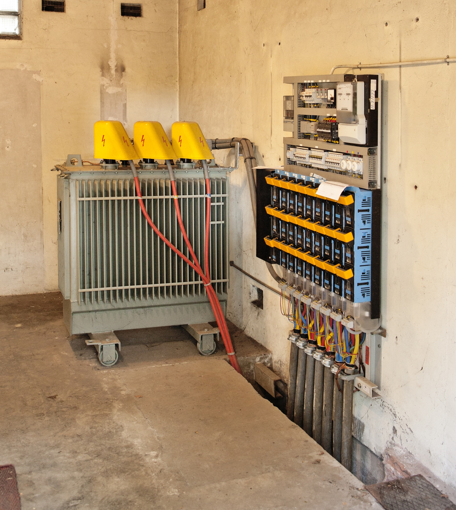

[.columns]
== Hoe denkt een data-architect?

[.column]
--

--

[.column]
--
.Topology
[d2,svg,theme=4]
----
vars: {
  d2-config: {
    layout-engine: elk
    pad: 5
  }
}

classes: {
  grid: {
    style: {
      fill: "#eccfcb"
      shadow: true
    }
  }
  enterprise: {
    style: {
      fill: "#d1e7c2"
      shadow: true
    }
  }
  market: {
    style: {
      fill: "#fffbef"
      shadow: true
    }
  }
}

direction: up

Substation.class: grid
VoltageLevel.class: grid
BaseVoltage.class: grid
PowerTransformer.class: grid
PowerTransformerEnd.class: grid
ConnectivityNode.class: grid
Terminal.class: grid
TopologicalNode.class: grid

PowerTransformer -- Substation
PowerTransformerEnd -- PowerTransformer
PowerTransformerEnd -- BaseVoltage
PowerTransformerEnd -- Terminal
Terminal -- ConnectivityNode
TopologicalNode -- Terminal
TopologicalNode -- ConnectivityNode
VoltageLevel -- Substation
VoltageLevel -- BaseVoltage
----

* concreet, naar abstract, naar concreet;
* van "echte wereld" naar klasse, eigenschap en relatie.
--
