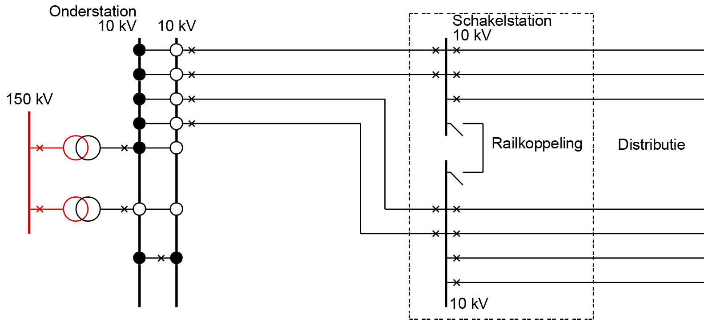
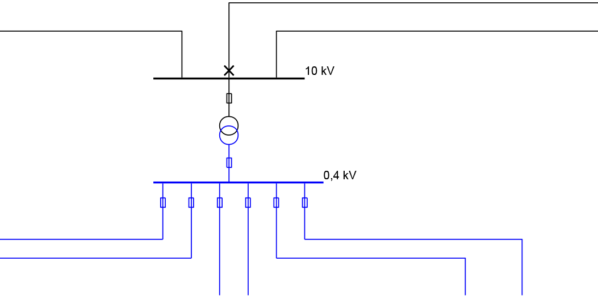

== Spanningsniveaus

[.stretch]
image::images/diagram-spanningsniveaus.png[]

[.notes]
--
* verschil tussen connectiviteit & topologie
* e-net is verzameling trafo's (versimpeld)
* trafo's staan in een station
* functioneel perspectief (functie/asset-scheiding): historisch, actueel en
gepland e-net, "door de jaren heen"
--

== HS/MS-onderstation

[.stretch]
image::../common/images/diagram-onderstation.png[]

== Schakelstation

[.stretch]

== Regelstation

[.stretch]
image::../common/images/diagram-regelstation.png[]

== Netstation

[.stretch]

