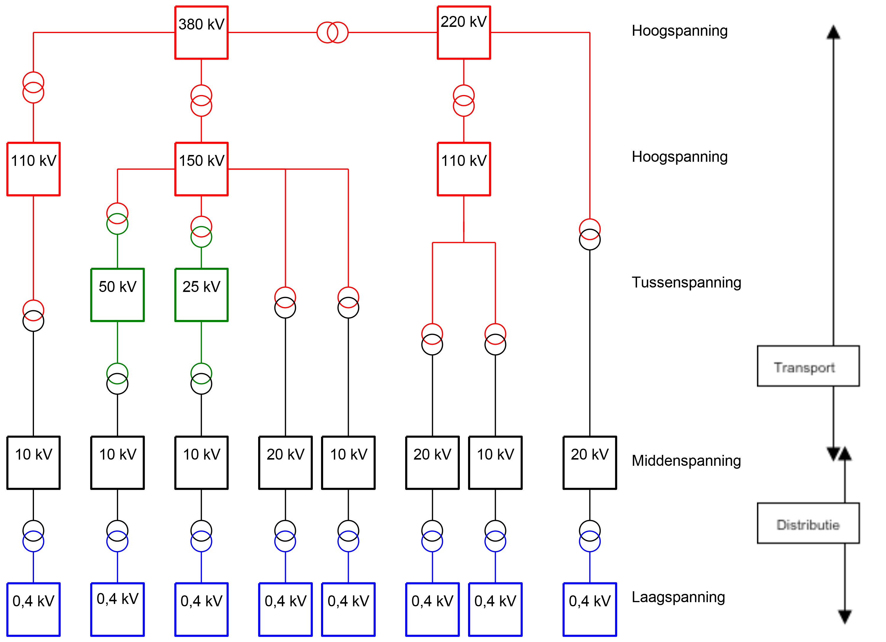
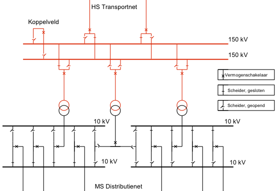

:author: R. Teunissen
:revdate: 2026-01-13

:backend: revealjs
:icons: font
:kroki-fetch-diagram: true
:revealjs_customtheme: ../themes/nbnl.css
:revealjsdir: https://cdn.jsdelivr.net/npm/reveal.js
:revealjs_width: 1280
:revealjs_height: 720
:revealjs_hash: true
:source-highlighter: highlight.js

== Team Semantiek | Capaciteitskaart v3
image::../common/images/haspels.jpg[canvas, size=cover, position=bottom]

[.columns]
== Agenda
image::../common/images/monteur.jpg[canvas, size=cover, position=bottom]

[.column]
--
--

[.column.has-text-left]
--
* dataproduct;
* connectiviteit & topologie;
* station & transformator;
* voedingsgebied;
* afnemer;
* transportcapaciteit;
* knelpunt;
* wachtrij;
* netuitbreiding;
* vragen.
--

include::../common/dataproduct.adoc[]

== Bouwblokken (IEC 61970-452)
image::../common/images/transformator.jpg[canvas, size=cover, position=bottom]

[.notes]
--
* standaard om standaard te maken
* subset van CIM-concepten die je daadwerkelijk gebruikt
--

[.columns]
== Bouwblokken

[.column]
--
.IEC 61970-452
[d2,svg,theme=4]
----
vars: {
  d2-config: {
    layout-engine: elk
    pad: 5
  }
}

classes: {
  all: {
    style.shadow: true
  }
}

direction: left

"Topology (TP)".class: all
"Equipment (EQ)".class: all
"Operation (OP)".class: all
"Geolocation (GL)".class: all
"Asset (AS)".class: all

"Topology (TP)" <- "Equipment (EQ)": "usedBy"
"Operation (OP)" <- "Equipment (EQ)": "usedBy"
"Geolocation (GL)" <- "Equipment (EQ)": "usedBy"
"Asset (AS)" <- "Equipment (EQ)": "usedBy"
----
--

[.column]
--
* Equipment (EQ): connectiviteit, _node/breaker_;
* Topology (TP): _use case_, _bus/branch_;
* Operation (OP): analoge & discrete metingen: gemeten, berekend & geschat;
* Geolocation (GL): fysieke locatie op het aardoppervlak;
* Asset (AS): asset- en projectinformatie.
--

== Architectuur

.Architectuur
[.stretch]
[d2,svg,theme=4]
----
vars: {
  d2-config: {
    pad: 20
  }
}

grid-rows: 5
grid-columns: 5

vertical-gap: 80
horizontal-gap: 160

classes: {
  *: {
    style: {
      shadow: true
    }
  }
  empty: {
    label: ""
    style: {
      fill: transparent
      stroke-width: 0
    }
  }
  verb: {
    style: {border-radius: 30}
  }
  noun: {
    style: {border-radius: 4}
  }
  artifact: {shape: page}
  business: {
    style: {
      fill: "#ffffaf"
    }
  }
  application: {
    style: {
      fill: "#afffff"
    }
  }
  technology: {
    style: {
      fill: "#afffaf"
    }
  }
}

Netbeheerder.class: [noun; business]
1.class: empty
EDSN.class: [noun; business]
2.class: empty
Consumer.class: [noun; business]

3.class: empty
4.class: empty
Broker.class: [noun; business]
5.class: empty
6.class: empty

7.class: empty
8.class: empty
Extract.class: [verb; business]
Transform.class: [verb; business]
Load.class: [verb; business]

"Dataloket".class: [verb; application]
"Data Product".class: [artifact; application]
"File Gateway".class: [verb; application]
10.class: empty
11.class: empty

12.class: empty
"JSON-LD".class: [artifact; technology]

Extract -> Transform: "triggers"
Transform -> Load: "triggers"
"File Gateway" -> "Extract": "serves"
"File Gateway" -> "Data Product": "accesses\n(read)"
Load -> Consumer: "serves"
EDSN -> Broker: "assigned to"
Broker -> Extract: "assigned to"
"JSON-LD" -> "Data Product": "realises"
"Dataloket" -> "Data Product": "accesses\n(write)"
"Netbeheerder" -> "Dataloket": "assigned to"

legend: "" {
  style: {
    fill: transparent
    stroke: transparent
  }
  grid-rows: 3
  grid-columns: 2
  grid-gap: 10
  near: bottom-right
  business_color: "" {
    style: {
      fill: "#ffffaf"
      stroke: black
      stroke-width: 1
    }
    width: 10
    height: 10
  }
  business_text: "Business" {
    shape: text
  }
  application_color: "" {
    style: {
      fill: "#afffff"
      stroke: black
      stroke-width: 1
    }
    width: 10
    height: 10
  }
  application_text: "Application" {
    shape: text
  }
  technology_color: "" {
    style: {
      fill: "#afffaf"
      stroke: black
      stroke-width: 1
    }
    width: 10
    height: 10
  }
  technology_text: "Technology" {
    shape: text
  }
}
----

== Connectiviteit & topologie
image::../common/images/monteur.jpg[canvas, size=cover, position=bottom]

== Spanningsniveaus

[.stretch]

[.columns]
== Impact
image::../common/images/monteur.jpg[canvas, size=cover, position=bottom]

[.column]
--
**Nu**

* 1 JSON-bestand
* Capaciteit & wachtrij op stationsniveau
* Knelpunten impliciet
* Voedingsgebied bestaat uit postcodegebieden
* Losstaand, niet herbruikbaar
--

[.column]
--
**Capaciteitskaart v3**

* 5 JSON-bestanden (2 voor TenneT)
* Capaciteit & wachtrij op transformatorniveau
* Knelpunten expliciet op trafo
* Voedingsgebied bestaat uit afnemers met een postcode6
* Herbruikbaar voor andere initiatieven
--

== Station & transformator
image::../common/images/intereur_os.jpg[canvas, size=cover, position=bottom]

* _Bouwblok_: Equipment
* HS/MS-onderstation van TenneT (vanuit NC13)
* tranformatoren van TenneT (380 kV -> 150 kV)
* transformatoren zijn gekoppeld aan een station

== Voedingsgebied
image::../common/images/intereur_os.jpg[canvas, size=cover, position=bottom]

* _Bouwblok_: Equipment
* secundaire transformatorzijde is het beginpunt van een voedingsgebied
* **hoe omgaan met veranderende voedingsgebieden?**
* wat zijn de congestiegebieden van TenneT?

== Afnemer
image::../common/images/intereur_os.jpg[canvas, size=cover, position=bottom]

* _Bouwblok_: Equipment, GeoLocation
* geaggregeerde afnemer wordt aan voedingsgebied gekoppeld
* elke geaggregeerde afnemer representeert een postcode6-gebied
* hoe omgaan met overlap: postcodegebied valt in twee voedingsgebieden?

== Transportcapaciteit
image::../common/images/intereur_os.jpg[canvas, size=cover, position=bottom]

* _Bouwblok_: Equipment, Operation
* aanwezig: maximale capaciteit die een energienet aankan ...
* benodigd: transportcapaciteit nodig om transportovereenkomsten uit te voeren
* ? gevraagd: transportcapaciteit nodig om transportverzoeken uit te voeren
* ? verwacht: geprognotiseerde transportcapaciteit (is dit vrije ruimte?)
* Invoeding & afname, door de jaren heen

== Knelpunt
image::../common/images/intereur_os.jpg[canvas, size=cover, position=bottom]

* _Bouwblok_: Equipment
* een transformator kan gemarkeerd worden als knelpunt
* congestie-informatie, zoals congestierapport
* bevat schaarstekleur, of leidt EDSN deze af op basis van transportcapaciteit?

== Wachtrij
image::../common/images/intereur_os.jpg[canvas, size=cover, position=bottom]

* _Bouwblok_: Equipment
* een knelpunt bevat wachtrij-informatie:
** vermogen in wachtrij
** aantal wachtenden in wachtrij
* hoe omgaan met prioriteringskader/visie wachtrijen?

== Netuitbreiding
image::../common/images/intereur_os.jpg[canvas, size=cover, position=bottom]

* _Bouwblok_: Asset
* werkzaamheden aan fysieke transformator (voedingsgebied)
* versimpeling van tijdsperiode (begin + eind), grip op einddatum
* hoe omgaan met levensduur nieuwe netfuncties?

include::../common/vragen.adoc[]

== HS/MS-onderstation

[.stretch]

