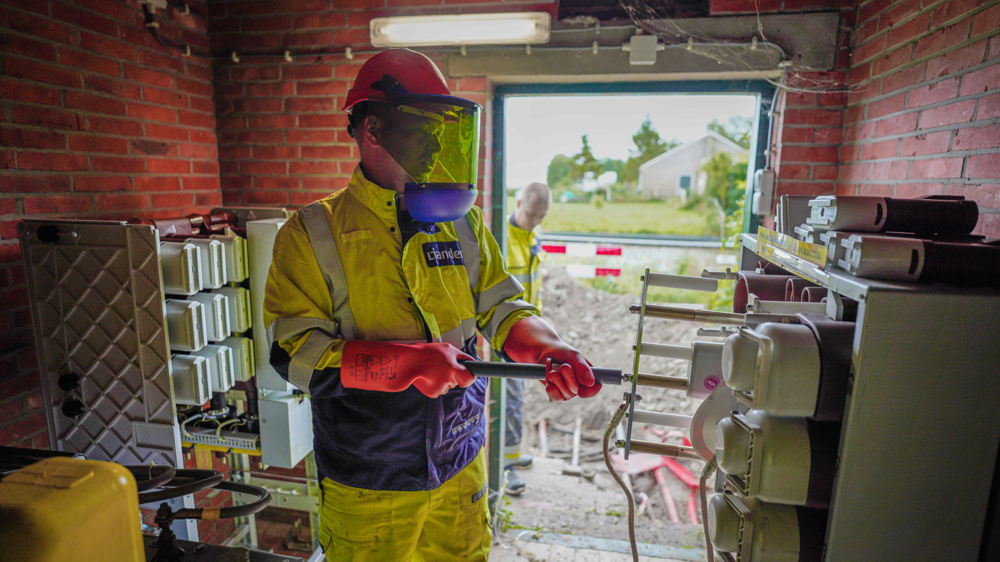
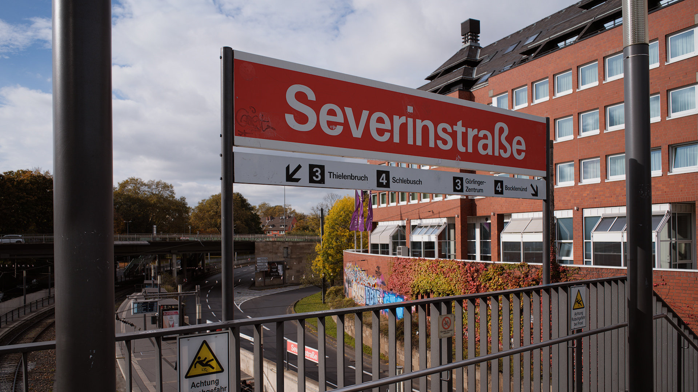
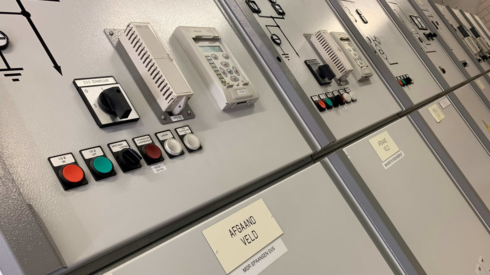

:author: R. Teunissen
:revdate: 2025-09-12

:backend: revealjs
:icons: font
:kroki-fetch-diagram: true
:kroki-server-url: http://fruit.ritger.nl:9000
:revealjs_customtheme: ../themes/nbnl.css
:revealjsdir: https://cdn.jsdelivr.net/npm/reveal.js
:revealjs_height: 720
:revealjs_width: 1280
:revealjs_hash: true
:source-highlighter: highlight.js

== Team Semantiek | Informatiemodellering

[%auto-animate]
== Wie ben ik? En wat doe je hier?

[%auto-animate]
== Wie ben ik? En wat doe je hier?

* solutionarchitect bij _Alliander_, werkzaam voor _Themateam Datadelen_ (PRO);
* data-architect bij _Netbeheer Nederland_, werkzaam voor _Team Semantiek_
(NBNL);
* "expert" bij _EU DSO Entity_, werkzaam voor de _JWG TF3: Data Interopability
Modeling_.

[.columns]
== Agenda

[.column]
--
--

[.column.has-text-left]
--
* betekenis & structuur;
* Common Information Model;
* data-uitwisseling;
* profielen;
* deliverables;
* vragen.
--

== Betekenis & structuur

* onderscheid tussen betekenis en structuur;
* *betekenis*: hoe _mensen_ informatie met elkaar uitwisselen;
* *structuur*: hoe _machines_ informatie met elkaar uitwisselen;
* grenzen vervagen ...

== Common Information Model (1)

* standaardisatie is een eis vanuit _Visie Datadelen_ [CDOs] en
_Doelarchitectuur Datadelen_ [CIOs/NBEA];
* internationale standaard voor het uitwisselen van gegevens over het
energienet, met een (eerste) focus op netrekenen;
* *1528* concepten met eigenschappen & relaties voor het beschrijven van het
energienet: _LEGO-blokjes_;

== Common Information Model (2)

* Team Semantiek modelleert informatiemodellen op basis van het CIM:
_handleiding_;
* netbeheerders maken een JSON-bestand (dataset) op basis van de handleiding;
* standaardisatie faciliteert interoperabiliteit & hergebruik [FAIR].

== Indeling van het CIM

.Toepasbare standaarden
[d2,svg,theme=4]
----
vars: {
  d2-config: {
    layout-engine: elk
    pad: 5
  }
}

classes: {
  all: {
    style.shadow: true
  }
}

"Grid (IEC 61970-301)".class: all
"Enterprise (IEC 61968-11)".class: all
"Market (IEC 62325-301)".class: all
----

== Data-uitwisseling
image::images/onderstation.jpg[canvas, size=cover, position=bottom]

== Dataproduct

[.stretch]
[d2,svg,theme=4]
----
vars: {
  d2-config: {
    layout-engine: elk
    pad: 5
  }
}

classes: {
  all: {
    style.shadow: true
  }
}

direction: up

Dataproduct.class: all
Dataset: {
  style: {
    shadow: true
    fill: "#f0a825"
  }
}
Dataservice.class: all
Voorwaarden.class: all

Dataset -> Dataproduct: partOf
Dataservice -> Dataproduct: partOf
Voorwaarden -> Dataproduct: partOf
----

[.columns]
== Voortbrengingsproces

[.column]
--
* Klant: overheid, markt of klant
* Netbeheerder: landelijk of regionaal
* TT Datadelen: Themateam Datadelen, PRO (NBNL & EDSN)
* Team Semantiek: ...
--

[.column]
--
.Voortbrengingsproces
[d2,svg,theme=4]
----
vars: {
  d2-config: {
    pad: 5
  }
}

shape: sequence_diagram

Klant -> Netbeheerder: "1. Informatievraag?"
Netbeheerder -> "TT Datadelen": "2. Informatievraag?"
"TT Datadelen" -> "TT Datadelen": "3. Analyse & ontwerp"
"TT Datadelen" -> "Team Semantiek": "4. Betekenis & structuur?"
"Team Semantiek" -> "TT Datadelen": "5. Begrippen & informatiemodel"
"TT Datadelen" -> "Netbeheerder": "6. Implementatie"
Netbeheerder -> Klant: "7. Dataproduct"
----
--

== Dataproducten

[d2,svg,theme=4]
----
vars: {
  d2-config: {
    layout-engine: elk
    pad: 5
  }
}

classes: {
  all: {
    style.shadow: true
  }
  dataproduct: {
    style: {
      shadow: true
      fill: "#f0a825"
    }
  }
}

direction: up

"Grid (IEC 61970-301)".class: all
"Enterprise (IEC 61968-11)".class: all
"Market (IEC 62325-301)".class: all

dp-capaciteitskaart-ls.class: dataproduct
dp-netbewust-laden.class: dataproduct
dp-meetdata.class: dataproduct

dp-capaciteitskaart-ls -> "Grid (IEC 61970-301)": "basedOn"
dp-netbewust-laden -> "Grid (IEC 61970-301)": "basedOn"
dp-netbewust-laden -> "Market (IEC 62325-301)": "basedOn"
dp-meetdata -> "Enterprise (IEC 61968-11)": "basedOn"
dp-meetdata -> "Market (IEC 62325-301)": "basedOn"
----

== Uitdaging: complexiteit groeit
image::images/transformator.jpg[canvas, size=cover, position=bottom]

* meer behoefte aan inzicht *=* grotere informatiemodellen;
* meer dataproducten *=* meer grip op hergebruik & extensies nodig;
* maar hoe?

== Profile Group

[.stretch]
[d2,svg,theme=4]
----
vars: {
  d2-config: {
    layout-engine: elk
    pad: 5
  }
}

classes: {
  all: {
    style.shadow: true
  }
}

direction: up

"Common Information Model (IEC TC57)": {
  "Grid (IEC 61970-301)"
  "Enterprise (IEC 61968-11)"
  "Market (IEC 62325-301)"
  style.shadow: true
}

"Common Grid Model Exchange\nStandard (ENTSO-E)".class: all
"Long Term Development\nStrategy (OFGEM)".class: all
"European Style Market\nProfile (ENTSO-E)".class: all
"IEC 62746 (IEC TC57)".class: all
"NBNL Profile Group\n(Team Semantiek)": {
  style: {
    fill: "#f28db1"
    shadow: true
  }
}

"Common Grid Model Exchange\nStandard (ENTSO-E)" -> "Common Information Model (IEC TC57)": "basedOn"
"Long Term Development\nStrategy (OFGEM)" -> "Common Information Model (IEC TC57)": "basedOn"
"Long Term Development\nStrategy (OFGEM)" -> "Common Grid Model Exchange\nStandard (ENTSO-E)": "basedOn"
"European Style Market\nProfile (ENTSO-E)" -> "Common Information Model (IEC TC57)": "basedOn"
"IEC 62746 (IEC TC57)" -> "Common Information Model (IEC TC57)": "basedOn"
"NBNL Profile Group\n(Team Semantiek)" -> "Common Information Model (IEC TC57)": "basedOn"
----

[.columns]
== Profiles

[.column]
--
.IEC 61970-452
[d2,svg,theme=4]
----
vars: {
  d2-config: {
    layout-engine: elk
    pad: 5
  }
}

classes: {
  all: {
    style.shadow: true
  }
}

direction: left

"Topology (TP)".class: all
"Steady State (SSH)".class: all
"Equipment (EQ)".class: all
"Operation (OP)".class: all
"Geolocation (GL)".class: all

"Topology (TP)" <- "Equipment (EQ)": "usedBy"
"Steady State (SSH)" <- "Equipment (EQ)": "usedBy"
"Operation (OP)" <- "Equipment (EQ)": "usedBy"
"Geolocation (GL)" <- "Equipment (EQ)": "usedBy"
----
--

[.column]
--
* Equipment (EQ): connectiviteit, _node/breaker_;
* Topology (TP): _use case_, _bus/branch_;
* Steady State Hypothesis (SSH): stabiele toestand van het net (normaalstand);
* Operation (OP): analoge & discrete metingen: gemeten, berekend & geschat;
* Geolocation (GL): fysieke locatie op het aardoppervlak.
--

[.columns]
== !

[.column]
--
[d2,svg,theme=4]
----
vars: {
  d2-config: {
    layout-engine: elk
    pad: 5
  }
}

classes: {
  all: {
    style.shadow: true
  }
  dataproduct: {
    style: {
      shadow: true
      fill: "#f0a825"
    }
  }
}

direction: up

"Common Information Model".class: all
"NBNL Profile Group": {
  style: {
    fill: "#f28db1"
    shadow: true
    animated: true
  }
}
"Equipment (EQ) Profile".class: all
"Topology (TP) Profile".class: all
"Geolocation (GL) Profile".class: all
dp-capaciteitskaart-ls.class: dataproduct
dp-nbnl-equipment.class: dataproduct
dp-meetdata.class: dataproduct

"NBNL Profile Group" -> "Common Information Model": basedOn
"Equipment (EQ) Profile" -> "NBNL Profile Group": basedOn
"Topology (TP) Profile" -> "NBNL Profile Group": basedOn
"Geolocation (GL) Profile" -> "NBNL Profile Group": basedOn

dp-capaciteitskaart-ls -> "Equipment (EQ) Profile": basedOn
dp-capaciteitskaart-ls -> "Topology (TP) Profile": basedOn
dp-capaciteitskaart-ls -> "Geolocation (GL) Profile": basedOn

dp-nbnl-equipment -> "Equipment (EQ) Profile": basedOn
dp-meetdata -> "Common Information Model": basedOn
----
--

[.column]
--
* alle dataproducten zijn interoperabel;
* op verschillende niveaus te structureren en af te leiden;
* in lijn met internationale en Europese standaarden/wetgeving.
--

== Tour de informatiemodel (NC13)

* https://netbeheer-nederland.github.io/docs-dev/doc-design/latest/netcode-h13.html#_functionele_eisen[functionele eisen & ontwerp];
* https://netbeheer-nederland.github.io/docs-dev/im-nbnl-equipment/latest/index.html[Equipment (EQ) Profile];
* https://netbeheer-nederland.github.io/docs-dev/dp-nbnl-equipment/latest/index.html[informatiemodel & betekenis];
* https://netbeheer-nederland.github.io/docs/im-tc57cim/latest/index.html[TC57 CIM].

== Developer experience

== Vragen?
image::images/the_simpsons.jpg[canvas, size=cover, position=bottom]

[.columns]
== Basisprincipes

== Identificeren van entiteiten

* individuen van classes worden geïdentificeerd door over te erven van de
_IdentifiedObject_-class;
* het individu krijgt een mRID-attribuut (Master Resource Identifier), waarmee
het object globaal uniek te identificeren is. Vaak is dit een UUID.

[.columns]
== Connectiviteit in het CIM

[.column]
--
[d2,svg,theme=4]
----
vars: {
  d2-config: {
    layout-engine: elk
    pad: 5
  }
}

classes: {
  all: {
    style.shadow: true
  }
}

direction: left

CNode: {
  shape: circle
}

CondEquip1 <-> CNode: {
  source-arrowhead.shape: none
  target-arrowhead.shape: circle
}

CNode <-> CondEquip2: {
  source-arrowhead.shape: circle
  target-arrowhead.shape: none
}
----
--

[.column]
--
* een _ConnectivityNode_ verbindt netfuncties zodat connectiviteit op een
T-splitsing en sterpunt gemodelleerd kan worden;
* geleiders (_ConductingEquipment_) worden tussen componenten verbonden via een
_Terminal_: één of meer overgangspunten van connectiviteit
--
