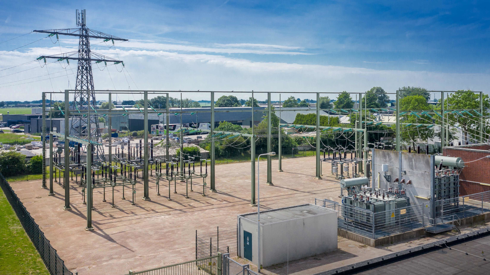

:author: R. Teunissen
:revdate: 2025-09-29

:backend: revealjs
:icons: font
:kroki-fetch-diagram: true
:kroki-server-url: http://fruit.ritger.nl:9000
:revealjs_customtheme: ../themes/nbnl.css
:revealjsdir: https://cdn.jsdelivr.net/npm/reveal.js
:revealjs_height: 720
:revealjs_width: 1280
:revealjs_hash: true
:source-highlighter: highlight.js

== Team Semantiek | Common Information Model
image::../common/images/haspels.jpg[canvas, size=cover, position=bottom]

[.columns]
== Agenda
image::../common/images/monteur.jpg[canvas, size=cover, position=bottom]

[.column]
--
--

[.column.has-text-left]
--
* betekenis & structuur;
* achtergrond;
* data-uitwisseling;
* profielen;
* modelleren;
* vragen.
--

include::../common/wie_ritger.adoc[]

include::../common/betekenis_structuur.adoc[]

include::../common/common_information_model.adoc[]

include::../common/dataproduct.adoc[]

include::../common/dataproduct_cim.adoc[]

include::../common/profile_group.adoc[]

== Modelleren voor ACM Netcode h13

[.notes]
--
* achtergrond NC13
* uitwisselen van assetdata tussen TSO en DSO
--

== Informatievraag, in detail

[cols="1, 2"]
|===
|Als |Wil ik

|DSO
|Inzicht in alle onderstations in het landelijk hoogspanningsnet

|DSO
|Inzicht in alle voor mij relevante koppelpunten met het landelijk
hoogspanningsnet
|===

[.notes]
--
* functionele eisen (tabel)
* per kwartaal (PI) goedgekeurd en gemodelleerd
--

include::../common/denkt_data_architect.adoc[]

[.columns]
== Onderstation

[.column]
--
.Onderstation
[d2,svg,theme=4]
----
vars: {
  d2-config: {
    layout-engine: dagre
    pad: 5
  }
}

classes: {
  grid: {
    style: {
      fill: "#eccfcb"
      shadow: true
    }
  }
  enterprise: {
    style: {
      fill: "#d1e7c2"
      shadow: true
    }
  }
  market: {
    style: {
      fill: "#fffbef"
      shadow: true
    }
  }
  empty: {
    label: ""
    style: {
      fill: transparent
      stroke: transparent
    }
  }
}

grid-rows: 3
grid-columns: 3
grid-gap: 150

GeographicalRegion.class: grid
SubGeographicalRegion.class: grid
Substation.class: grid

Substation -> SubGeographicalRegion: "Region"
SubGeographicalRegion -> GeographicalRegion: "Region"
----
--

[.column]
--
* `GeographicalRegion` als Nederland (landsdeel);
* `SubGeographicalRegion` als dekkingsgebied (netbeheerder);
* `Substation` als onderstation.
--

[.notes]
--
* whiteboard: welke stukjes CIM heb je nodig?
* gekoppeld met Begrippenmodel
* gericht op uitwisseling: JSON-LD
* constraints & multipliciteit
* SHACL Schema
--

[.columns]
== Koppelpunt

[.column]
--
.Koppelpunt
[d2,svg,theme=4]
----
vars: {
  d2-config: {
    layout-engine: dagre
    pad: 5
  }
}

classes: {
  grid: {
    style: {
      fill: "#eccfcb"
      shadow: true
    }
  }
  enterprise: {
    style: {
      fill: "#d1e7c2"
      shadow: true
    }
  }
  market: {
    style: {
      fill: "#fffbef"
      shadow: true
    }
  }
  empty: {
    label: ""
    style: {
      fill: transparent
      stroke: transparent
    }
  }
}

grid-rows: 3
grid-columns: 3
grid-gap: 150

GeographicalRegion.class: grid
SubGeographicalRegion.class: grid
Substation.class: grid

Voltage.class: grid
BaseVoltage.class: grid
VoltageLevel.class: grid

1.class: empty
2.class: empty
ConnectivityNode.class: grid

3.class: empty
4.class: empty
BoundaryPoint.class: grid

BaseVoltage -> Voltage: "nominalVoltage"
VoltageLevel -> BaseVoltage: "BaseVoltage"
VoltageLevel -> Substation: "Substation"
Substation -> SubGeographicalRegion: "Region"
SubGeographicalRegion -> GeographicalRegion: "Region"
ConnectivityNode -> VoltageLevel: "ConnectivityNodeContainer"
ConnectivityNode -> BoundaryPoint: "BoundaryPoint"
----
--

[.column]
--
* `VoltageLevel` met `BaseVoltage` als "lege" installatie met spanningsniveau;
* `ConnectivityNode` als koppelpunt (overdrachtspunt TSO/DSO);
* `BoundaryPoint` als expliciete markering overdrachtspunt (extensie CGMES);
* Uitwerking van het
https://netbeheer-nederland.github.io/docs-dev/dp-nbnl-equipment/latest/index.html[dataproduct].
--

[.notes]
--
* generiek herbruikbaar? -> in profiel(en)
* Modeling Guidelines
* mens, proces & techniek voor duurzame voortbrenging
--

== Tooling

* https://linkml.io/[LinkML], geïntegreerd met Github Actions;
* https://netbeheer-nederland.github.io/docs/[Normatieve] en
https://netbeheer-nederland.github.io/docs-dev/[informatieve] documentatie;
* SHACL Schema, JSON-LD voorbeelden, aanvullende documentatie;
* Beheerd door Team Semantiek.

== Vragen!

* To what degree is CIM already applied and what the plans are for adopting it
at Alliander. E.g., is/will CIM be adopted for managing and exchanging the grid
model? [Muhammad]
* Current and future applications. So, what are the current and foreseen
application of CIM from Alliander’s point of view? E.g., is/will the model be
exchange with ENTSO-E/DSA Entity for a particular use? [Muhammad]
* Huidige toepassing is dataproducten vanuit de gezamelijke netbeheerders,
toekomst is verder uitbouwen van de Profile Group. Binnen Alliander wordt CIM
extensief gebruikt binnen _System Operations_ en _Klant & Ontwerp_
(netarchitecten). _OT-Hub_ (SCADA) is aan het migrereren richting CIM voor
metingen.

== Vragen!

* How can we establish a communication channel with Alliander to exchange and
share knowledge on using CIM? [Muhammad]
* Er is een open vacature voor TenneT binnen Team Semantiek, meld je aan!

== Vragen!

* Is Alliander involved with activities in the field of power system dynamics?
(If so, there may be a link with ENTSO-e/DSA Entity in TenneT.) [Muhammad]
* Welke specifieke activiteiten? Is dit b.v. het werk met LFEnergy, of de Power
Grid Modeler (PGM)?

== Vragen!

* Heeft Alliander ervaring met CIMTool? Zo ja, hoe gebruikt Alliander CIMTool?
[Marja]
* Team Semantiek is actief betrokken bij de ontwikkeling van CIMTool, ondermeer
bij de export naar LinkML, en de ambitie om ook de bronschema's in LinkML vast
te leggen.

== Vragen!

* Wordt er gebruik gemaakt van CIMcontextor? Zo ja, hoe? [Richard]
* Nee, we gebruiken LinkML voor al onze modellen, draw.io en D2 voor de
free-form diagrammen.

== Vragen!

* Hoe heeft Alliander de governance van CIM en CIM extensies ingericht?
* Team Semantiek beheert informeel de NL namespace van het CIM. We zijn nu met
een traject bezig om dit formeel in te richten met de NEN/IEC.

== Vragen!

* Brengt Alliander haar zelf ontwikkelde extensies in bij nationale of
internationale normgroepen?
* Team Semantiek is betrokken bij verschillende Europese en internationale
initiatieven, en brengen waar relevant onze bevindingen in. Dit kan via de
CIMug, Working Groups of Europese Commissie (via ENTSO-E/EU DSO Entity) zijn.

include::../common/vragen.adoc[]
