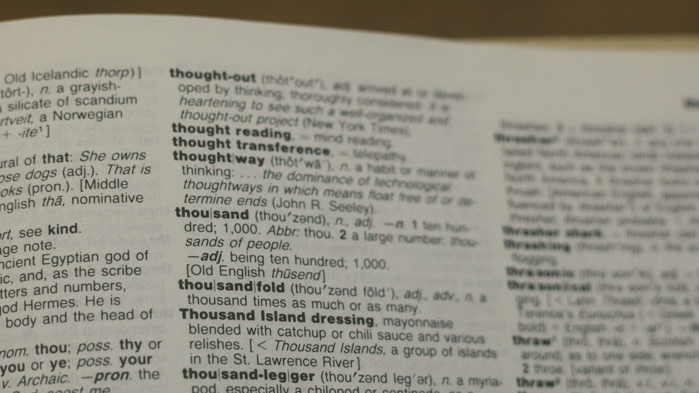

:author: R. Teunissen
:revdate: 2025-11-27

:backend: revealjs
:icons: font
:kroki-fetch-diagram: true
:kroki-server-url: http://fruit.ritger.nl:9000
:revealjs_customtheme: ../../themes/nbnl.css
:revealjsdir: https://cdn.jsdelivr.net/npm/reveal.js
:revealjs_height: 720
:revealjs_width: 1280
:revealjs_hash: true
:source-highlighter: highlight.js

== Team Semantiek | Introductie
image::../common/images/haspels.jpg[canvas, size=cover, position=bottom]

[.columns]
== Agenda
image::../common/images/monteur.jpg[canvas, size=cover, position=bottom]

[.column]
--
--

[.column.has-text-left]
--
* betekenis & structuur;
* begrippen & nationaal registers;
* dataproducten & profielen;
* implementatie TSO/DSO-interface;
* vragen.
--

include::../common/wie_ritger.adoc[]

include::../common/betekenis_structuur.adoc[]

== be·te·ke·nis (_de_; _v_; meervoud: _betekenissen_)
image::../common/images/onderstation.jpg[canvas, size=cover, position=bottom]

1. _inhoud, zin_: de betekenis van een woord
2. _belang, waarde_: een zaak van (enige) betekenis

[.columns]
== Voedingsgebied?

[.column]
--
* gebied op aardoppervlakte
--

[.column]
--
groep van aansluitingen vanuit topologie
--

== Woordenboek

1. _begrippenmodel_: definities vallend onder energiesysteembeheer;
2. _nationale energieregisters_: begrippen in context, ontsloten vanuit de
gereguleerde taak.

[.notes]
--
* wat als je data moet gaan uitwisselen?
--

== struc·tuur (_de_; _v;_ meervoud: _structuren_)
image::../common/images/onderstation.jpg[canvas, size=cover, position=bottom]

1. manier waarop een samengesteld geheel is opgebouwd.

== Data-uitwisseling

* netbeheerders wisselen data -onderling en met derden- uit;
* we wisselen data uit als _dataproducten_, onder de Doelarchitectuur
Datadelen;
* in tegenstelling tot de betekenis willen we standaardiseren;

include::../common/common_information_model.adoc[]

== !

1. modellen van dataproducten;
2. NBNL Profile Group.

== ACM Netcode Elektriciteit h13
image::../common/images/onderstation.jpg[canvas, size=cover, position=bottom]

[.notes]
--
* achtergrond NC13
* uitwisselen van assetdata tussen TSO en DSO
--

include::../common/vragen.adoc[]
