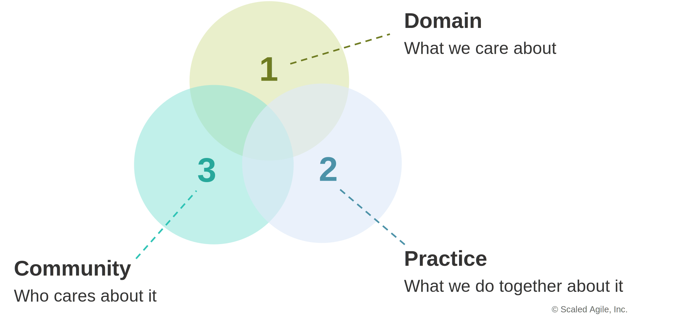

:author: R. Teunissen
:revdate: 2026-01-13

:backend: revealjs
:icons: font
:kroki-fetch-diagram: true
:revealjs_customtheme: ../themes/nbnl.css
:revealjsdir: https://cdn.jsdelivr.net/npm/reveal.js
:revealjs_width: 1280
:revealjs_height: 720
:revealjs_hash: true
:source-highlighter: highlight.js

== Team Semantiek | CIM Community of Practice
image::../common/images/onderstation.jpg[canvas, size=cover, position=bottom]

[.columns]
== Agenda
image::../common/images/monteur.jpg[canvas, size=cover, position=bottom]

[.column]
--
--

[.column.has-text-left]
--
* Community of Practice;
* Structuur
* Thema's
* Planning
* vragen.
--

[.columns]
== Wat is de CoP?

[.column]
--
* *domein*: modeleren en data uitwisselen met het CIM;
* *community*: data engineers, data-architecten en geïnteresseerden;
* *practice*: ervaringen, technieken, kennis over CIM delen, gezamelijke _best
  practices_ en standaardisatie.
--

[.column]
--

--

[.columns]
== Structuur

[.column]
--
.Structuur
[d2,svg,theme=4]
----
vars: {
  d2-config: {
    layout-engine: elk
    pad: 5
  }
}

classes: {
  shadow: {
    style: {
      shadow: true
    }
  }
}

Motivatie.class: shadow
Lessons Learned.class: shadow
Know-how.class: shadow
Gastsprekers.class: shadow
Tooling.class: shadow

Motivatie -> Lessons Learned -> Gastsprekers
Motivatie -> Know-how
Motivatie -> Tooling
----
--

[.column]
--
* motivatie: wat breng je en wat neem je mee?
* know-how: instructie en uitleg;
* lessons learned: wat hebben we gedaan en wat hebben we geleerd?
* gastsprekers: CIM is een internationale standaard, wat doen anderen?
* tooling: automatiseren en versnellen.
--

== Bevoegdheden

* *CoP*: leren, informeren & samenwerken;
* *Team Semantiek*:
** beheer https://modellen.netbeheernederland.nl/data-products[NBNL Profile Group];
** onderdeel van NEN, UCA, IEC.

== Sessies

* elke *vijf weken* een meeting van *60 minuten*;
* agenda met minstens één presentatie;
* *drie* sessies vormen samen een *thema*;
* sessies worden opgenomen en onder de deelnemers verspreid.

== Thema's
image::../common/images/onderstation.jpg[canvas, size=cover, position=bottom]

1. *CIM Tooling*: effectief gebruik van CIM is onderheving aan een tooling
   ecosysteem. Automatisering, platformfaciliteiten en beleid zijn een
   cruciale succesfactor in het beschikbaar maken van informatie voor
   uitwisseling. Dit thema brengt theorie en praktijk bij elkaar, vanuit het
   perspectief van de NL netbeheerders én Stattnet, de Noorse TSO.
2. *NBNL Profile Group*: Als onderdeel van het CIM beschrijft de _IEC
   61970-452_ de profielen en CIM-classes nodig voor data-uitwisseling voor een
   _Energy Management System_ (EMS). Netbeheer Nederland beheert een _Profile
   Group_ onder _IEC 61970-452_ voor uitwisseling van informatie onder
   _Systeemcode h12_ en use cases voor Datadelen. Dit thema ligt toe hoe
   _Profiles_ werken, wat de toegevoegde waarde is van _Profiles_ voor OFGEM
   (de Britse ACM) en hoe de _Profiles_ zijn geïmplementeerd voor verschillende
   use cases.

== Planning thema's

[.stretch]
[mermaid]
----
%%{init: {"theme":"neutral"}}%%
gantt
    title Sessies
    dateFormat  YYYY-MM-DD
    axisFormat  %Y-%m-%d

    Dataplatform EDSN        : milestone, 2026-06-09, 0d

    section CIM Tooling
    UNO en netrekenen        : milestone, 2026-07-14, 0d
    Stattnet                 : milestone, 2026-08-18, 0d
    LinkML                   : milestone, 2026-09-22, 0d

    section NBNL Profile Group
    NBNL Profile Group       : milestone, 2026-10-27, 0d
    OFGEM en LTDS            : milestone, 2026-12-01, 0d
    EQ voor SC12             : milestone, 2027-01-05, 0d
----

include::../common/vragen.adoc[]
