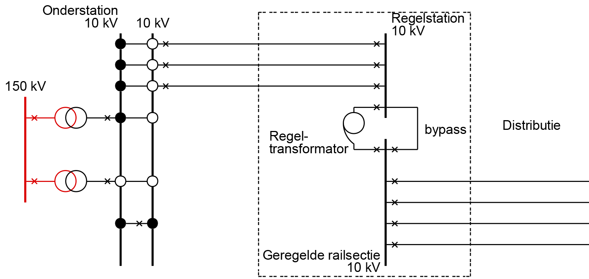

:author: R. Teunissen
:revdate: 2026-01-13

:backend: revealjs
:icons: font
:kroki-fetch-diagram: true
:revealjs_customtheme: ../themes/nbnl.css
:revealjsdir: https://cdn.jsdelivr.net/npm/reveal.js
:revealjs_width: 1280
:revealjs_height: 720
:revealjs_hash: true
:source-highlighter: highlight.js

== Team Semantiek | NBNL Profile Group
image::../common/images/haspels.jpg[canvas, size=cover, position=bottom]

[.columns]
== Agenda
image::../common/images/monteur.jpg[canvas, size=cover, position=bottom]

[.column]
--
--

[.column.has-text-left]
--
* dataproduct;
* NBNL Profile Group;
* planning;
* vragen.
--

include::../common/dataproduct.adoc[]

include::../common/common_information_model.adoc[]

include::../common/profile_group.adoc[]

== Architectuur

.Architectuur
[.stretch]
[d2,svg,theme=4]
----
vars: {
  d2-config: {
    pad: 20
  }
}

grid-rows: 5
grid-columns: 5

vertical-gap: 80
horizontal-gap: 160

classes: {
  *: {
    style: {
      shadow: true
    }
  }
  empty: {
    label: ""
    style: {
      fill: transparent
      stroke-width: 0
    }
  }
  verb: {
    style: {border-radius: 30}
  }
  noun: {
    style: {border-radius: 4}
  }
  artifact: {shape: page}
  business: {
    style: {
      fill: "#ffffaf"
    }
  }
  application: {
    style: {
      fill: "#afffff"
    }
  }
  technology: {
    style: {
      fill: "#afffaf"
    }
  }
}

Netbeheerder.class: [noun; business]
1.class: empty
EDSN.class: [noun; business]
2.class: empty
Consumer.class: [noun; business]

3.class: empty
4.class: empty
Broker.class: [noun; business]
5.class: empty
6.class: empty

7.class: empty
8.class: empty
Extract.class: [verb; business]
Transform.class: [verb; business]
Load.class: [verb; business]

"Dataloket".class: [verb; application]
"Data Product".class: [artifact; application]
"File Gateway".class: [verb; application]
10.class: empty
11.class: empty

12.class: empty
"JSON-LD".class: [artifact; technology]

Extract -> Transform: "triggers"
Transform -> Load: "triggers"
"File Gateway" -> "Extract": "serves"
"File Gateway" -> "Data Product": "accesses\n(read)"
Load -> Consumer: "serves"
EDSN -> Broker: "assigned to"
Broker -> Extract: "assigned to"
"JSON-LD" -> "Data Product": "realises"
"Dataloket" -> "Data Product": "accesses\n(write)"
"Netbeheerder" -> "Dataloket": "assigned to"

legend: "" {
  style: {
    fill: transparent
    stroke: transparent
  }
  grid-rows: 3
  grid-columns: 2
  grid-gap: 10
  near: bottom-right
  business_color: "" {
    style: {
      fill: "#ffffaf"
      stroke: black
      stroke-width: 1
    }
    width: 10
    height: 10
  }
  business_text: "Business" {
    shape: text
  }
  application_color: "" {
    style: {
      fill: "#afffff"
      stroke: black
      stroke-width: 1
    }
    width: 10
    height: 10
  }
  application_text: "Application" {
    shape: text
  }
  technology_color: "" {
    style: {
      fill: "#afffaf"
      stroke: black
      stroke-width: 1
    }
    width: 10
    height: 10
  }
  technology_text: "Technology" {
    shape: text
  }
}
----

== Planning
image::../common/images/monteur.jpg[canvas, size=cover, position=bottom]

== Dataproduct: Equipment (1)

[.stretch]
[mermaid]
----
%%{init: {"theme":"neutral"}}%%
gantt
    dateFormat  YYYY-MM-DD
    axisFormat  %Y-%m

    section HS
    TenneT (NC13, 1) :2026-01-01, 90d
    TenneT (NC13, ?) :2026-07-01, 90d

    section TS/MS
    Enexis (NC13, 2) :2026-04-01, 90d
    Enexis? (C-kaart, 4) :2026-07-01, 90d
    Liander (NC13, 2) :2026-04-01, 90d
    Liander? (C-kaart, 4) :2026-07-01, 90d
    Stedin (NC13, 2) :2026-04-01, 90d
    Stedin (C-kaart, 4) :2026-04-01, 90d

    section LS
    Liander (Buurtnet, 5) :2026-04-01, 90d
----

== Dataproduct: Equipment (2)

1. [HS] HS/MS-onderstation, spanningsniveau, koppelpunt
2. [MS] **Transformator**, **spanningsniveau**
3. [MS] **Regelstation**, **schakelstation**, **transformator**,
**spanningsniveau**, **afnemer**, **transportcapaciteit**, **voedingsgebied**,
MS-route, veld
4. [MS] **Regelstation**, **schakelstation**,
**transformator**, **spanningsniveau**, **afnemer**, **transportcapaciteit**,
**voedingsgebied**, wachtrij, congestiegebied, knelpunt
5. [LS] Netstation, transformator, spanningsniveau, transportcapaciteit,
afnemer

== Dataproduct: Operation

[.stretch]
[mermaid]
----
%%{init: {"theme":"neutral"}}%%
gantt
    dateFormat  YYYY-MM-DD
    axisFormat  %Y-%m

    section MS
    Stedin (C-kaart, 1) :2026-04-01, 90d
    Enexis? (C-Kaart, 1) :2026-07-01, 90d
    Liander? (C-Kaart, 1) :2026-07-01, 90d

    section LS
    Liander (Buurtnet, 2) :2026-01-01, 90d
----

1. [MS] Benodigde en gevraagde transportcapaciteit
2. [LS] Belastingprofiel

== Dataproduct: Topology

[.stretch]
[mermaid]
----
%%{init: {"theme":"neutral"}}%%
gantt
    dateFormat  YYYY-MM-DD
    axisFormat  %Y-%m

    section MS
    Stedin (C-kaart, 1) :2026-04-01, 90d
    Liander? (C-kaart, 1) :2026-07-01, 90d
    Enexis? (C-kaart, 1) :2026-07-01, 90d

    section LS
    Liander (Buurtnet, 2) :2026-04-01, 90d
----

1. [MS] Koppeling tussen station/voedingsgebied
2. [LS] Koppeling tussen afnemer/transformator

== Dataproduct: GeoLocation

[.stretch]
[mermaid]
----
%%{init: {"theme":"neutral"}}%%
gantt
    dateFormat  YYYY-MM-DD
    axisFormat  %Y-%m

    section MS
    Stedin (C-kaart, 1) :2026-04-01, 90d
    Liander? (C-kaart, 1) :2026-07-01, 90d
    Enexis? (C-kaart, 1) :2026-07-01, 90d

    section LS
    Liander (Buurtnet, 2) :2026-04-01, 90d
----

1. [MS] voedingsgebied postcode6
2. [LS] Fysieke locatie netstation & afnemer

== Dataproduct: Asset

[.stretch]
[mermaid]
----
%%{init: {"theme":"neutral"}}%%
gantt
    dateFormat  YYYY-MM-DD
    axisFormat  %Y-%m

    section MS
    Stedin (C-kaart, 1) :2026-04-01, 90d
    Enexis? (C-Kaart, 1) :2026-07-01, 90d
    Liander? (C-Kaart, 1) :2026-07-01, 90d
----

1. [MS] Netuitbreiding

include::../common/vragen.adoc[]

== Spanningsniveaus

[.stretch]
image::images/diagram-spanningsniveaus.png[]

== HS/MS-onderstation

[.stretch]
image::images/diagram-onderstation.png[]

== Schakelstation

[.stretch]
image::images/diagram-schakelstation.png[]

== Regelstation

[.stretch]

== Netstation

[.stretch]
image::images/diagram-netstation.png[]
